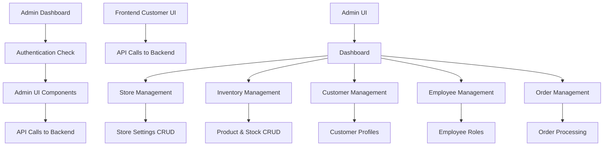

# Admin Sector Plan for Noor Panjabi Ghar

## Overview

This plan outlines the development of a professional admin sector for the Noor Panjabi Ghar e-commerce platform. The admin system will manage store information, stock/inventory, customer data, employee information, and order processing. It will integrate seamlessly with the existing frontend, ensuring data consistency and real-time updates.

**Note:** This plan focuses on the frontend admin sector. Backend development (database, APIs) will be handled separately.

## Technology Stack

- **Frontend**: Next.js 16 with React 19, TypeScript, Tailwind CSS
- **State Management**: Redux Toolkit (existing + admin slices)
- **Backend**: Separate API (assumed provided)
- **Authentication**: Role-based (extending existing user system)
- **UI Components**: Existing component library + admin-specific components

## Architecture



## Database Schema

### Core Entities

1. **User** (extended with role: customer/admin/employee)

   - id, email, password, role, name, etc.

2. **Product**

   - id, name, description, price, category, images, variants

3. **Inventory**

   - product_id, stock_quantity, location, supplier

4. **Customer** (linked to User)

   - user_id, address, phone, order_history

5. **Employee** (linked to User)

   - user_id, department, salary, permissions

6. **Order**

   - id, customer_id, items, total, status, date

7. **StoreInfo**
   - settings, policies, contact info

## Key Features

### Store Information Management

- **General Settings**: Store name, description, logo upload, contact information (phone, email, address), business registration details
- **Policies**: Return policy editor, shipping policy, privacy policy, terms of service, warranty information
- **Business Operations**: Business hours configuration, holiday schedule, operating regions, delivery zones
- **Online Presence**: Social media links, website URLs, contact form settings, SEO meta tags
- **Payment & Commerce**: Payment gateway integration settings, supported currencies, tax rate configuration, discount codes
- **Notifications**: Email templates for orders/customers, SMS settings, alert configurations for low stock/admin notifications

### Inventory & Stock Management

- **Product Catalog**: Add/edit/delete products with images, descriptions, pricing, variants (size, color), categories
- **Stock Tracking**: Real-time stock levels, automatic low stock alerts, stock movement history
- **Supplier Management**: Supplier profiles, purchase orders, supplier performance tracking
- **Bulk Operations**: CSV import/export for products, bulk price updates, category management
- **Inventory Reports**: Stock reports, sales velocity, inventory turnover, out-of-stock analysis
- **Warehouse Management**: Multiple warehouse support, stock transfers, location tracking

### Customer Management

- **Customer Profiles**: Detailed customer information, contact history, preferences, addresses
- **Order History**: Complete order history per customer, order status tracking, repeat purchase analysis
- **Communication Tools**: Email campaigns, customer notifications, feedback collection, support tickets
- **Loyalty Programs**: Points system, rewards management, customer segmentation
- **Analytics**: Customer lifetime value, churn analysis, demographic reports
- **Support**: Customer service tools, issue tracking, resolution workflows

### Employee Management

- **Employee Profiles**: Personal information, contact details, employment history, documents
- **Role & Permissions**: Role-based access control, permission assignment, department management
- **Performance Tracking**: Performance reviews, goal setting, KPI monitoring
- **Payroll Integration**: Salary management, benefits tracking, time-off requests
- **Training & Development**: Training records, certification tracking, skill development
- **Communication**: Internal messaging, announcements, employee engagement tools

### Order Management

- **Order Processing**: Order status workflow (pending, confirmed, processing, shipped, delivered, cancelled)
- **Order Details**: Complete order information, item details, pricing, taxes, discounts
- **Shipping Management**: Shipping method selection, tracking number integration, carrier management
- **Returns & Refunds**: Return request processing, refund processing, exchange handling
- **Order Analytics**: Order trends, revenue reports, fulfillment metrics
- **Customer Service**: Order modifications, customer inquiries, dispute resolution

## Folder Structure

```
app/(admin)/
├── layout.tsx (admin layout with sidebar)
├── dashboard/
│   └── page.tsx (main dashboard with stats)
├── store/
│   └── page.tsx (store settings form)
├── inventory/
│   ├── page.tsx (inventory overview)
│   ├── products/
│   │   └── page.tsx (product management table)
│   └── stock/
│       └── page.tsx (stock levels and alerts)
├── customers/
│   ├── page.tsx (customer list)
│   └── [id]/
│       └── page.tsx (customer profile)
├── employees/
│   ├── page.tsx (employee list)
│   └── [id]/
│       └── page.tsx (employee profile)
├── orders/
│   ├── page.tsx (order list)
│   └── [id]/
│       └── page.tsx (order details)
└── settings/
    └── page.tsx (admin settings)
```

## Admin Menu/Navigation

The admin interface will feature a collapsible sidebar navigation with the following menu items:

- **Dashboard**: Overview with key metrics, charts, and recent activity
- **Store Management**: Store settings, policies, and configuration
- **Inventory Management**
  - Products: Product catalog management
  - Stock: Stock levels and inventory tracking
- **Customer Management**: Customer list, profiles, and analytics
- **Employee Management**: Employee list, roles, and performance
- **Order Management**: Order processing, tracking, and analytics
- **Settings**: Admin preferences, permissions, and system settings

## Pages Structure

- **Dashboard Page**:

  - Sales charts (daily/weekly/monthly)
  - Order status overview
  - Inventory alerts
  - Recent orders/customers
  - Revenue metrics

- **Store Settings Page**:

  - Tabbed interface for different settings categories
  - Form validation and save functionality

- **Product Management Page**:

  - Data table with search/filter/sort
  - Add/Edit product modal
  - Bulk actions
  - Image upload

- **Stock Management Page**:

  - Stock level table
  - Low stock alerts
  - Stock adjustment tools

- **Customer List Page**:

  - Customer table with filters
  - Customer detail view
  - Export functionality

- **Employee Management Page**:

  - Employee table
  - Role assignment
  - Performance metrics

- **Order Management Page**:

  - Order table with status filters
  - Order detail view with status updates
  - Shipping tracking integration

- **Settings Page**:
  - Admin profile
  - Permission management
  - System preferences

## Design Guidelines

- **Professional Appearance**: Clean, modern design consistent with the frontend
- **Responsive Design**: Mobile-first approach, tablet and desktop optimized
- **Color Scheme**: Primary colors from brand, with admin-specific accents
- **Typography**: Consistent font hierarchy, readable for data-heavy pages
- **Component Library**: Leverage existing UI components (buttons, forms, tables)
- **Data Visualization**: Charts for analytics using libraries like Chart.js or Recharts
- **User Experience**: Intuitive navigation, loading states, error handling
- **Accessibility**: WCAG compliant, keyboard navigation, screen reader support
- **Performance**: Optimized for large data sets, lazy loading, pagination

## Integration with Frontend

- Admin changes reflect immediately on frontend
- Shared data models
- Real-time inventory updates
- Customer data synchronization

## Security Considerations

- Role-based access control
- API rate limiting
- Data validation
- Audit logging

## Development Phases

1. Enhance frontend authentication for admin role checking
2. Build admin dashboard layout and navigation
3. Develop individual management pages (store, inventory, customers, employees, orders)
4. Implement admin-specific Redux slices
5. Integrate with backend APIs for data operations
6. Add UI enhancements (data tables, charts, responsive design)
7. Testing, integration, and deployment
